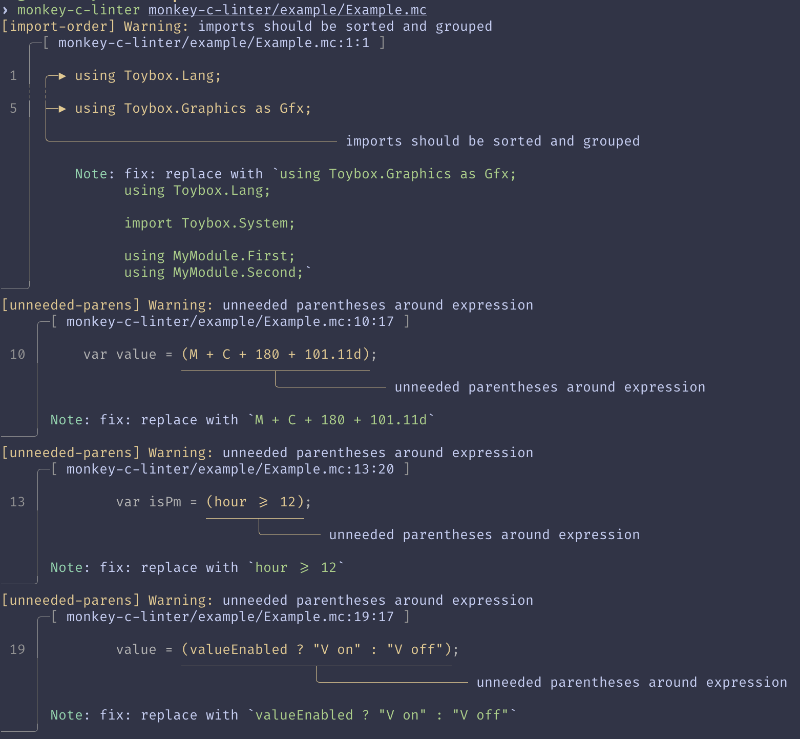

# `monkey-c-linter`

Linter for Monkey C code to find both stylistic and other issues in the code.
When possible the linter supports automatically fixing the issues by using the
`--fix` flag.

> [!NOTE]
> The fixer doesn't format the code to normalize after changes so the user is
> expected to run the [`monkey-c-formatter`][formatter] after applying fixes.

[formatter]: ../monkey-c-formatter
